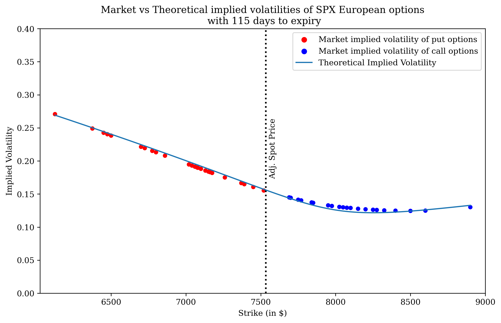
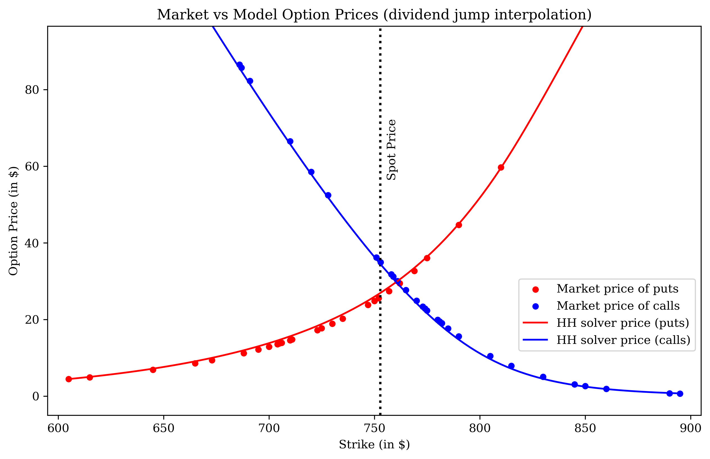
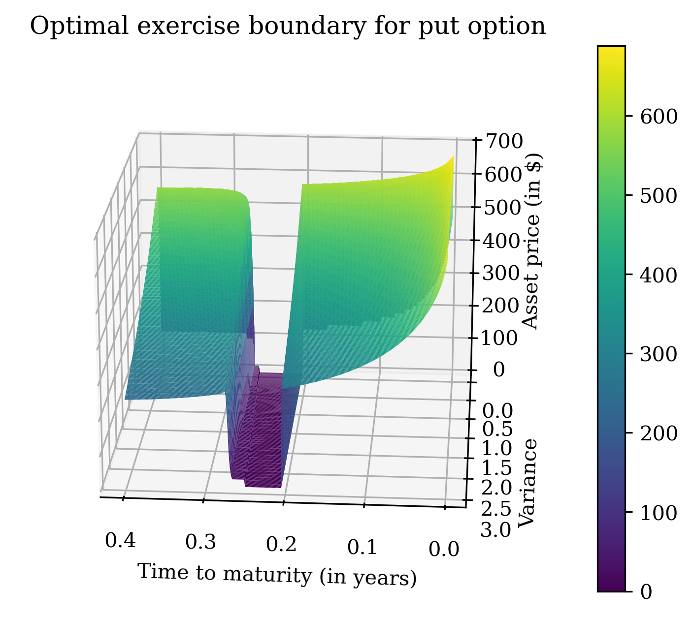
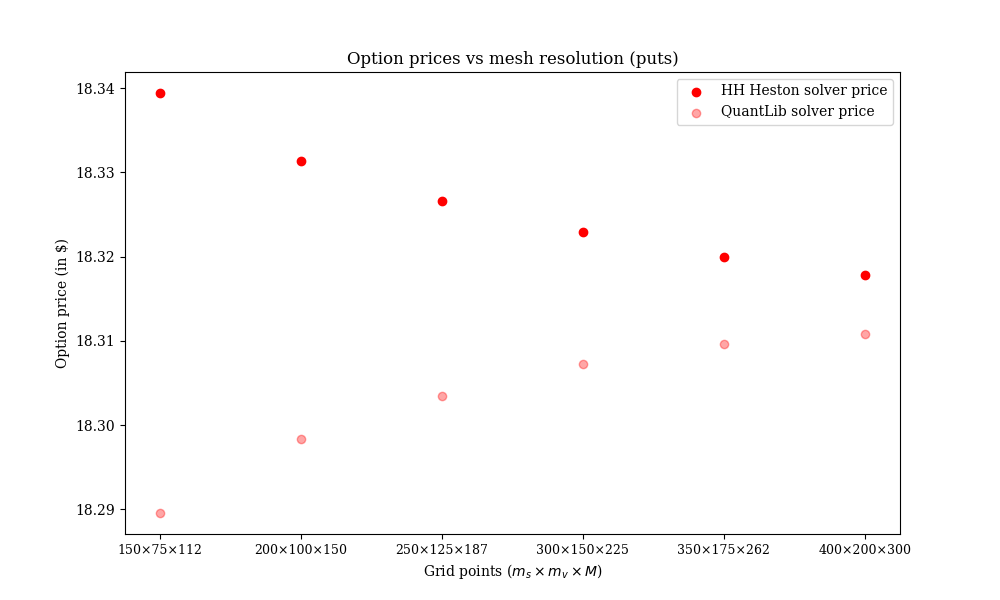

# An End-to-End Framework for Calibration and Option Pricing under the Heston Stochastic Volatility Model

## Overview

This project implements an end-to-end quantitative finance workflow for calibrating the Heston stochastic volatility model to real market data and applying the calibrated model to price vanilla American equity options.

The workflow begins in the notebook `SPX-HestonFourier-Calibration.ipynb`, where the Heston model is calibrated to the market-observed implied volatilities of European SPX options, thereby extracting the market's risk-neutral expectations for the future dynamics of the S&P 500 Index. The calibrated model parameters are then used in `SPY-HestonFDADI-Pricing.ipynb` to price American options on the SPDR S&P 500 ETF Trust (SPY). These options are linked to the same underlying market while additionally incorporating the complexities of early exercise and discrete dividend payments. Option prices are computed using a custom finite-difference pricing engine based on the Hundsdorfer–Verwer Alternating Direction Implicit (ADI) scheme, with discrete dividends handled explicitly through asset-grid interpolation at ex-dividend dates. These implementations are contained in the `HestonFD` and `QLHestonFD` modules, while `HestonFD` additionally provides access to the early exercise boundary.

This project integrates stochastic volatility modelling, Fourier-based option pricing, finite-difference methods for solving partial differential equations, calibration to real market data, and computational optimisation through sparse linear algebra.

---

## Project Workflow

```text

                 SPX Market Option Chain + SOFR Daily Rate
                                    │
                                    ▼
                        Heston Model Calibration
                        (Differential Evolution)
                                    │
                                    ▼
                      Calibrated Heston Parameters
                                    │
                                    ▼
            SPY Market Option Chain + ES Futures Implied Spot
                     + SOFR Daily Rate + Dividends
                                    │
                                    ▼
                     American Option Pricing using
                     Hundsdorfer–Verwer ADI Solver
                                    │
                                    ▼
                       Validation & Performance
                        • QuantLib Comparison
                        • Market Price Comparison
```

---

## Features


- Calibration of the Heston stochastic volatility model to real SPX option data
- Fourier-based option pricing of European options
- Two-dimensional finite-difference solver for American options
  - Hundsdorfer–Verwer ADI time-stepping scheme
  - Support for discrete cash dividends
  - Early exercise handled using the projection method
  - Sparse matrix implementation for efficient linear solves
  - Early exercise boundary visualisation
  - Convergence analysis of option prices with mesh refinement
- Comparison against live market prices for SPY options
- Computation of option Greeks

### Calibration

The following Heston model parameters are calibrated using **Differential Evolution**:

- Initial variance, $v_0$
- Long-run variance, $\theta$
- Mean reversion speed, $\kappa$
- Volatility of variance, $\sigma$
- Correlation, $\rho$

The objective function minimises the error between:

- Market implied volatilities
- Model implied volatilities

rather than option prices, resulting in a more stable calibration across strikes and maturities. Model option prices are computed using the Lewis Fourier pricing approach (Ref. 4 implemented in the `HestonFourierEuropean` module), from which the corresponding implied volatilities are obtained for comparison with market data.



### American Option Pricing

After calibration, the Heston pricing PDE is solved using a finite-difference method. The implementation employs:

- Hundsdorfer–Verwer ADI-IT splitting
- Non-uniform spatial grids
- Sparse tridiagonal operators
- Backward time stepping

Early exercise is enforced after every time step using the projection method. The resulting finite-difference pricing engine is referred to throughout this project as the HH Heston solver, as it is based on the ADI methodology of Haentjens and in 't Hout (Ref. 1). This implementation can be found in the `HestonFD` module, while the corresponding QuantLib implementation is in the `QLHestonFD` module.



#### Discrete Dividends

This project explicitly models discrete dividend payments. At each ex-dividend date:

- the asset grid is shifted,
- the option value is interpolated onto the shifted grid,

allowing realistic pricing of American equity options.

#### Early exercise boundary

The HH Heston solver also tracks the early exercise boundary, which separates the regions where it is optimal to exercise an American option from where it is optimal to continue holding it. Visualising this boundary provides insight into the exercise behaviour of the option and offers an additional diagnostic for assessing the numerical solution.



#### HH Heston solver validation

The HH Heston solver pricing engine is validated against that of QuantLib. Typical observations include:

- The HH Heston solver produces option prices that closely agree with those obtained using QuantLib, with both implementations converging to a similar limiting value as the computational mesh is refined.
- Pricing differences relative to market data depend on calibration quality, prevailing market conditions, and data freshness.
- The remaining discrepancies primarily reflect model assumptions and calibration limitations rather than numerical inaccuracies.

| Type | HH Price | QuantLib Price | Market Price | Delta (HH) | Delta (QL) | Vega (HH) | HH Runtime (sec) | QL Runtime (sec) |
|------|--------|--------|--------|--------|--------|--------|--------|--------|
| Put |	18.33 |	18.30 |	17.23 |	-0.20 |	-0.20 |	6.09 |	2.14 |	1.04 |
| Call|	18.18 |	18.13 |	19.01 |	0.51  |	0.51  |	6.76 |	1.87 |	1.25 |

<br>


#### Performance Optimisation

The HH Heston finite-difference solver stores the tridiagonal system matrices in sparse format. Compared with a dense implementation, this significantly reduces computational cost by:

- lowering memory usage,
- accelerating linear solves,
- exploiting the banded structure of finite-difference operators.

This optimisation enables substantially faster pricing while maintaining identical numerical results. The runtime is approximately 2-5x that of QuantLib.

---

## Market Data and Inputs

| Data | Source |
|------|--------|
| SPX Option Chain | Yahoo Finance |
| SPY Option Chain | Yahoo Finance |
| E-mini S&P 500 Futures | Yahoo Finance |
| SOFR Daily Rate | FRED |
| SPY Dividend Schedule | Yahoo Finance |

* **SOFR Daily Rate:** The Secured Overnight Financing Rate (SOFR) is used to infer the risk-free interest rate employed for discounting cash flows and defining the risk-neutral dynamics.
* **E-mini S&P 500 Futures (ES):** ES futures prices are used to infer the spot term structure of the S&P 500 Index corresponding to different option maturities, ensuring consistency between the underlying asset price and the option expiration date.

The repository includes market data snapshots used to reproduce the results presented in the notebooks in the folder `options_data`. The data-fetching scripts can be used to download updated market data from Yahoo Finance and FRED.
  
---

## Visualisations

The notebooks include visualisations of:

- Calibrated implied volatility smile
- Implied volatility surface
- Delta surface
- Vega surface
- American optimal exercise boundary
- Calibration diagnostics
- Pricing comparisons
- Price convergence with mesh refinement

---

## Python Libraries

- NumPy
- SciPy
- pandas
- QuantLib
- matplotlib
- yfinance

---

## Repository Structure

```text
.
├── notebooks/
│   ├── SPX-HestonFourier-Calibration.ipynb
│   │      Calibration of Heston parameters
│   │      to SPX options
│   │
│   └── SPY-HestonFDADI-Pricing.ipynb
│          Prices American SPY options using 
│          the calibrated Heston model
│
├── fetch_data/
│   ├── ES_futures.py
│   ├── SOFR_zero_rate.py
│   └── YfinanceFetchData.py
│
├── option_pricing_engine/
│   ├── HestonFD.py
│   ├── HestonFourierEuropean.py
│   └── QLHestonFD.py
│
├── options_data/
│   ├── ^spx_options.csv
│   ├── ^spx_div_options.npy
│   ├── spy_options.csv
│   ├── spy_div_options.npy
│   ├── esfutures.csv
│   ├── SOFR_rate.npy
│   ├── saved_time.pkl
│   └── Heston_parameters_SPX.npy
│
├── utils/
│   ├── BSM_imp_vol.py
│   └── CalibrationFilter.py
│
├── requirements.txt
│
└── README.md
```

---

## Results

The project demonstrates an integrated quantitative research workflow by:

- calibrating the Heston stochastic volatility model to real market data,
- pricing American options with discrete dividends and comparing against market option prices,
- validating results against the industry-standard QuantLib library,
- analysing option sensitivities and optimal exercise behaviour,
- optimising computational performance through sparse numerical methods.

---

## Future Improvements

Potential extensions include:

- Local-stochastic volatility models
- Adaptive mesh refinement
- Stochastic interest rates
- Jump-diffusion extensions

---

## References

The implementation is based on the following references:

1. T. Haentjens and K. J. in 't Hout, *ADI Schemes for Pricing American Options under the Heston Model*, Applied Mathematical Finance, 2015.
2. S. L. Heston, *A Closed-Form Solution for Options with Stochastic Volatility with Applications to Bond and Currency Options*, The Review of Financial Studies, 1993.
3. P. Wilmott, *Paul Wilmott on Quantitative Finance*, 2nd Edition, Wiley, 2006.
4. Y. Hilpisch, *Derivative Analytics with Python with Data Analysis, Models, Simulation, Calibration and Hedging*, Wiley, 2015.
5. D. Tavella and C. Randall, *Pricing Financial Instruments: The Finite Difference Method*, Wiley, 2000.
6. The QuantLib Contributors, *QuantLib: A Free/Open-Source Library for Quantitative Finance*.

---

## License

This project is released under the **MIT License**.
